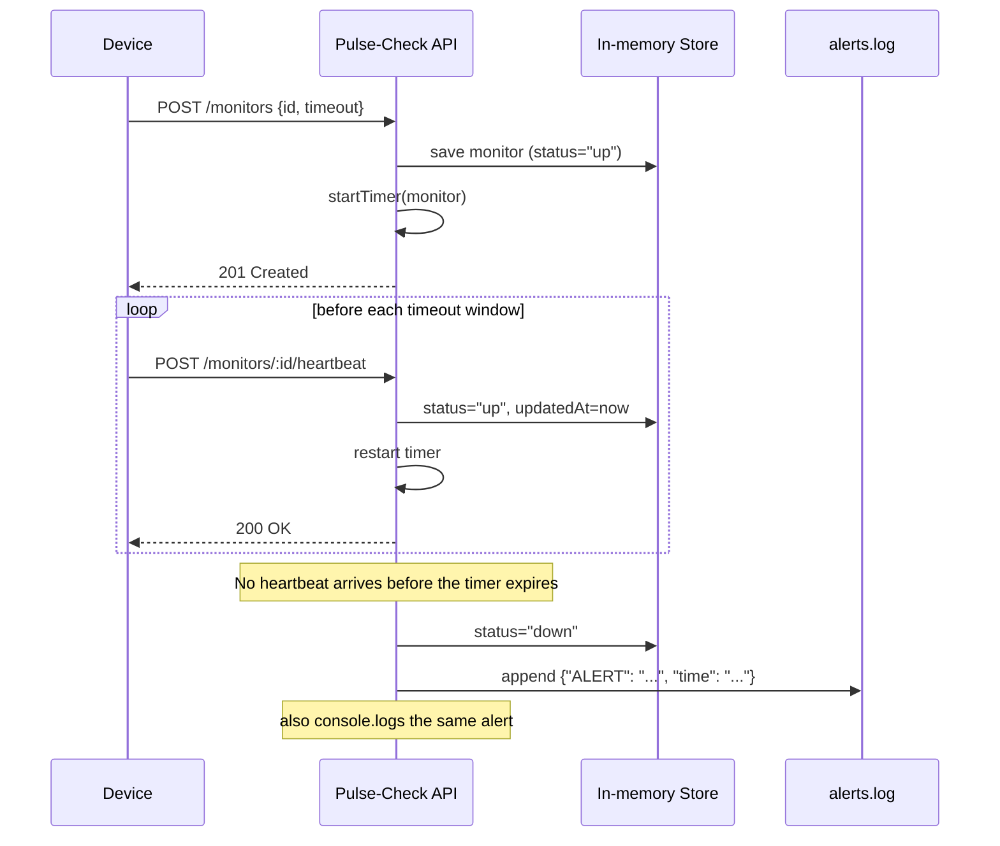

# Pulse-Check API ("Watchdog" Sentinel)

A **Dead Man's Switch** REST API for CritMon Servers Inc. Remote devices (solar farms, weather stations) register a "monitor" with a countdown timer and must "ping" (heartbeat) before it expires. If a device goes quiet, the API fires an alert automatically instead of waiting for a human to notice.

---

## 1. Architecture Diagram



---

## 2. Setup Instructions

**Requirements:** Node.js (v18+ recommended).

```bash
# 1. Clone your fork
git clone https://github.com/<your-username>/Pulse-Check-API.git
cd Pulse-Check-API

# 2. Install dependencies
npm install

# 3. Run the server
npm start          # plain node
# or
npm run dev         # nodemon, auto-restarts on file changes
```

The server listens on `http://localhost:3000`. There is no database or `.env` config required, all state is kept in memory for the lifetime of the process.

---

## 3. API Documentation

All request/response bodies are JSON. All timestamps are ISO-8601 strings.

### `POST /monitors` — Register a monitor (User Story 1)

**Request body:**
```json
{ "id": "device-123", "timeout": 60, "alert_email": "admin@critmon.com" }
```

| Field         | Type   | Required | Notes                                              |
|---------------|--------|----------|-----------------------------------------------------|
| `id`          | string | yes      | Must be non-empty. `__proto__`/`constructor`/`prototype` are rejected. |
| `timeout`     | number | yes      | Countdown length in **seconds**. Must be > 0.       |
| `alert_email` | string | no       | Stored on the monitor; not currently used to send real email. |

**Responses:**
| Status | When                                      |
|--------|-------------------------------------------|
| `201`  | Monitor created; countdown timer started.  |
| `400`  | `id` missing/invalid, or `timeout` missing/invalid. |
| `409`  | A monitor with that `id` already exists.   |

```json
// 201
{ "message": "Monitor created for device-123" }
```

### `POST /monitors/:id/heartbeat` — Reset the countdown (User Story 2)

Called by the device to prove it's alive. Restarts the timer from `timeout` seconds, sets `status` back to `"up"`, and un-pauses the monitor if it was paused or already marked `"down"`.

**Responses:**
| Status | When                                |
|--------|--------------------------------------|
| `200`  | Timer reset.                          |
| `404`  | No monitor exists with that `id`.     |

```json
// 200
{ "message": "Heartbeat received for device-123" }
```

### Alert firing (User Story 3)

There is no endpoint for this, it happens internally. If a monitor's timer reaches zero with no heartbeat, the API:
1. Sets that monitor's `status` to `"down"`.
2. Logs `{"ALERT": "Device device-123 is down!", "time": "<timestamp>"}` to the console **and** appends it to `alerts.log`. Refer to Developer's Choice
### `POST /monitors/:id/pause` — Snooze a monitor (Bonus User Story)

Stops the countdown completely — no alert can fire while paused. Calling `/heartbeat` afterwards automatically un-pauses it and restarts the timer.

**Responses:**
| Status | When                                |
|--------|--------------------------------------|
| `200`  | Timer stopped, `status` set to `"paused"`. |
| `404`  | No monitor exists with that `id`.     |

```json
// 200
{ "message": "Monitor device-123 paused" }
```

---

## 4. Developer's Choice: Structured Alert Audit Log

**What:** In addition to `console.log`-ing an alert, every failure event is also appended as a JSON line to `alerts.log` (via `fs.appendFile`, so it doesn't block the request-handling event loop).

**Why:** `console.log` output disappears the moment the process restarts or nobody happens to be watching the terminal. For a service whose entire job is "tell someone when a device goes dark," losing that signal defeats the purpose. Writing each alert as a JSON line gives support engineers a durable, machine-parseable audit trail they can `tail`, `grep`, or feed into a log aggregator — without needing a database for this small project.

Example `alerts.log` contents:
```json
{"ALERT":"Device device-123 is down!","time":"2026-07-09T14:46:44.325Z"}
```

---

## 5. Known Limitations

- **In-memory only:** monitors and their timers live in a plain JS object and are lost on server restart — there is no persistence layer.
- **No real email delivery:** `alert_email` is accepted and stored, but alerts are only logged to the console and `alerts.log`, not actually emailed.
- **Single-process:** timers are plain `setTimeout` handles, so this won't scale horizontally across multiple server instances without moving timer state to a shared store.
